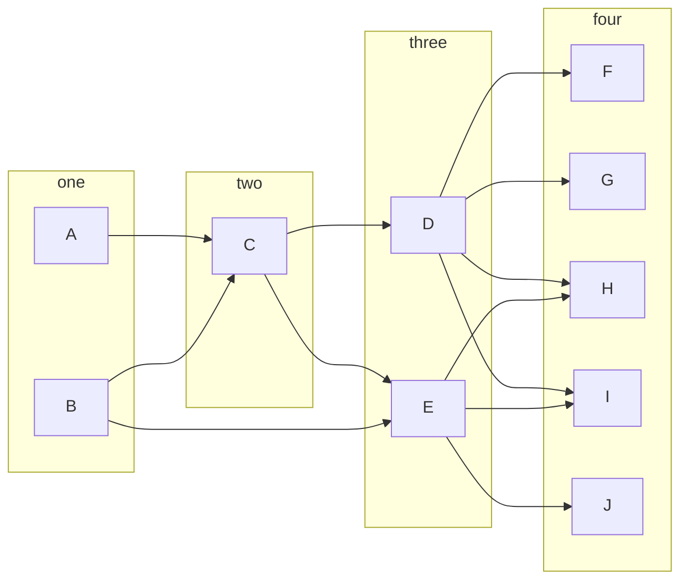

[GraphViz](https://graphviz.org/) has a well-deserved reputation for being good at network layout.  There are many parts to its magic.  This is an attempt to describe the core parts of what GraphViz does with layered networks to reduce the number of edge crossings (e.g., the [dot layout algorithm](https://graphviz.org/docs/layouts/dot/)...not to be confused with the [DOT language](https://graphviz.org/doc/info/lang.html)).  This is a subset of concerns for [layered graph drawing](https://en.wikipedia.org/wiki/Layered_graph_drawing).

## Layered Networks
For this post, layered networks are networks where the nodes can be **grouped** and those groups can be **ordered** so that all of the edges point to layers with a higher index number. 

The example above has three layers. Notice, edges don't have to point to the *next* layer, just one with a higher number.  A network is layered (or not) *independent* of how it is drawn. Layered networks are necessarily acyclic because edges can not point "back" to nodes lower numbered groups. (Layered networks can be defined for undirected graphs, but using directed graphs makes the source and target of edges more clear in writing.)

## Sugiyama 1981

The main methods for GraphViz are found in "[Methods for visual understanding of hierarchical system structures](https://ieeexplore.ieee.org/document/4308636)," Kozo Sugiyama, Shojiro Tagawa and Mitsuhiko Toda (1981).  The paper includes many options for achieving a "good" graph layout, but this post only looks at the one that is deemed most practical: a Barycentric heuristic to minimize edge crossing. 

Other parts of the paper that may be of interest include:
- A discussion of what makes a graph layout readable
- Techniques to create a layered network from an un-layered network (which edges to cut, how to decide which layer a node belongs to)
- Techniques to deal with edges that "skip" layers
- A "penalty minimization" to reduce edge crossing (combinatoric in nature, and thus computationally expensive, but used as a comparison point for the barycentric heuristic)
- Considerations for ordering within a layer beyond edge-crossing (called 'horizontal positioning' in the paper because they assume drawings go top-to-bottom)

## The Barycentric Heuristic

The goal of the Barycentric Heuristic is to minimize edge crossings.  It does this by changing the order of nodes *within* a layer. Nodes are constrained to stay in a line with other nodes in their layer, so a node can only move along one axis (vertically in the example graph).   This means that node *order* within the layer is the most important component to compute (other parts of the paper address spacing).

The term **barycenter** comes from astronomy and refers to the center-of-mass of a system. In general, the barycenter may lay outside of any of the masses (e.g., a two-body system or a donut have barycenters that are not inside of the masses), but still communicates the focus of the system.  Barycenter is adopted by analogy here.  The analogy of mass is the weight of links attached to a node.

Using layers `three` and `four` in the example diagram, the Barycentric Heuristic on a two-layer graph take the following steps:
1. Fixes the node order for the first layer (e.g., layer `four`).
2. Assign each node in the second layer a position number (e.g., -- `D: 1, E: 2`)
3. In the second layer, compute the average of the positions of the sources of its edges.  For layer `five` this is `F: 1/1=1, G: (1+2)/2 3/2, H: (1+2)/2, I: (1+2)2=3/2, J: 2/1=2`
4. Compute an order by placing the nodes in barycenter order (smallest to largest).  If there is a tie, keep them in their original order.

This method can be extended to multiple levels by considering level pairs in turn[^1].

Two additional heuristics are used to further improve the layout:
1. Trying different orderings of "tied" elements (step #4 above).  This explores targeted alternatives.
2. The algorithm goes both "up" and "down" through the hierarchy.  In a single-directional pass, the "parent" level influences the "child" level placement but not vice-versa.  Flipping it around allows the reverse to occur BUT requires some termination condition because it is possible to have a graph that flips between different layouts on subsequent passes.  The solution used is to record prior configurations and stop if a prior-observed configuration appears again OR after a pre-set number of passes.

[^1]: For completeness, the authors also considered computing barycenters based on both the next-level-up and the next-level-down.  This did NOT improve layouts (and sometimes did worse than the up/down method).  The theory was that when considering only one direction at a time, it is using already-optimized node ordering, but when looking at both directions one side is less optimized than the other.

## Some questions

The source paper concerns itself with *practical* solutions...and computing has advanced somewhat since 1981.  My big question is "how big is too big" for the penalty minimization method on modern hardware?  The paper indicates this algorithm has stronger guarantees than the barycentric heuristic, but was not practical for their applications *in 1981*.  Does it better results?  What is the graph size cut-off?

Though the GraphViz website sites Sugiyama 1981 as part of its underlying techniques, how has it evolved since then? Is this barycentric system still in use, or has it been superseded?

## Conclusion

Understanding how GraphViz places nodes in layered-graphs has helped me debug when DOT is not working well.  

Barycentric node placement is one of several things discussed in the paper. (Perhaps more on others later.)

