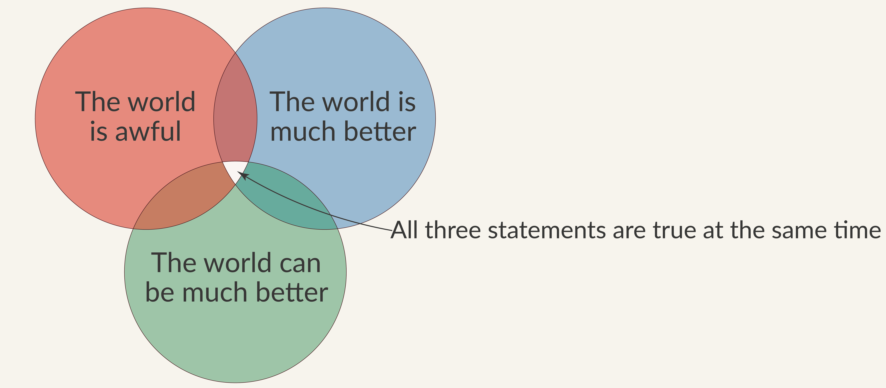

[The world is awful. The world is much better. The world can be much better.](https://ourworldindata.org/much-better-awful-can-be-better) is a concise post on how all three statements can be true at once.   I like the post shows a feeling of progress (the world is better), discontent (the world is awful) and hope for the future (the world can be much better) **all at once**!!  Their context is child-mortality.  

I sometimes feel like I'm being forced to choose between a sense progress, discontent and hope...all three can be equally true.  The world is complicated, and it is simple.  It is much better than it was in so many ways, but I still hope for better yet.

---
Teaser image originally sourced from [Our World in Data](https://ourworldindata.org/) and provided under [CC BY 4.0](https://chooser-beta.creativecommons.org/img/cc-logo.f0ab4ebe.svg)
